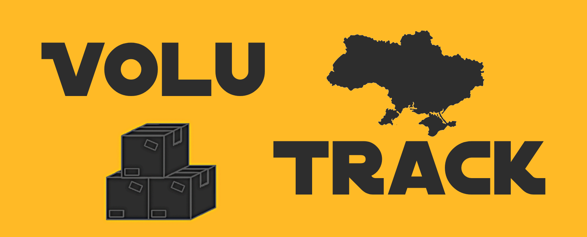

# VoluTrack

Volunteer Logistics and Accounting Helper - a project to make logistic easier and cheaper, accounting more accurate and tight.




## Roadmap

- Initial commit. Spring boot project was created. Set up postgres and flyway.
- Registration is done commit. Added user layer(roles and service), registration service with email verification.
- Registration service is recovered commit. Fixed email verification sender. Changed Spring Boot version to newer.  Added Spring Security.
- Authentication is done commit. Access JWT token in HttpOnly Cookies, Refresh token in SQL.
- Big fix 1.0: Removed Redis(reason: wrong use); fixed email sending(now sending is asynchronous, better performance); improved models(removed waste stuff); Swagger UI is added; Added Docker file to containerize project.
- Branch dev, security fix: Authorization performance process is increased(no useless requests to DB); Fixed vulnerabilities: after logout, access token is placed to deactivated tokens in Redis cache; registration and authentication endpoints for authenticated users are forbidden, logout and refresh access token is allowed only for authenticated.; User's fullname is divided into firstname and lastname; Fixed a bug in confirmation email resend controller for registration.
## Usage

```shell
$ docker-compose --env-file ./src/main/resources/.env up -d
```

## Authors

- [@Vasyl Stepanov](https://www.github.com/VasylStepanov)
